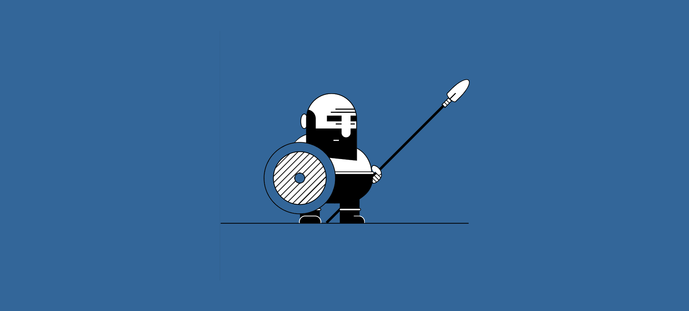

# ⚔️ Warrior-CSS

A pure CSS illustration of a warrior knight — no images, no JavaScript, just CSS magic.

Built entirely with CSS properties like `box-shadow`, `gradients`, `clip-path`, and `position`, this project renders a fully detailed knight character straight in the browser.

---

## 🖼️ Preview



---

## 🌐 Live Demo

👉 **[View on GitHub Pages](https://binaryvortex.github.io/Warrior-CSS/)**

---

## 🚀 Usage

1. **Clone or download** the repository:

   ```bash
   git clone https://github.com/BinaryVortex/Warrior-CSS.git
   ```

2. **Open `index.html`** in your browser — no build step or dependencies needed.

3. **Use in your own project** by copying the relevant HTML structure and linking `style.css`:

   ```html
   <!-- In your HTML -->
   <link rel="stylesheet" href="style.css">

   <div class="cartoon hb">
     <div class="lance hb ha"></div>
     <div class="point r ha"></div>
     <div class="leg hb ha"></div>
     <div class="body b r hb ha"></div>
     <div class="head b hb ha"></div>
     <div class="shield b r"></div>
   </div>
   ```

---

## ✨ Features

- 🎨 **Pure CSS** — zero images, zero JavaScript
- 🧩 **Single stylesheet** — all styling in one `style.css` file
- 📐 **Responsive** — uses `vmin` units so the warrior scales to any viewport size
- ⚡ **Lightweight** — the entire illustration is under 4 KB of CSS
- 🔧 **Hackable** — easy to tweak colours, proportions, and details by editing CSS variables and values

---

## 🛠️ How It Works

The warrior is built from six `<div>` elements, each styled with creative use of CSS:

| Element | What it draws |
|---------|--------------|
| `.cartoon` | The overall bounding box and ground shadow |
| `.head` | Helmet with visor, plume and face guard |
| `.body` | Torso with armour plates and shoulder guard |
| `.leg` | Both legs with knee armour |
| `.lance` | The diagonal lance/spear shaft and grip wrappings |
| `.point` | The lance tip (spearhead) |
| `.shield` | Circular shield with a heraldic chevron pattern |

Key techniques used:

- **`box-shadow`** — layered multiple shadows to paint shapes and details without extra elements
- **`radial-gradient` / `linear-gradient`** — colours, patterns and textures
- **`clip-path`** — precise silhouette trimming (e.g. the helmet visor angle)
- **`::before` / `::after` pseudo-elements** — double the drawable surfaces for each element
- **CSS custom property (`--blue`)** — single variable controls the overall colour theme

---

## 🌍 Browser Compatibility

| Browser | Supported |
|---------|-----------|
| Chrome 80+ | ✅ |
| Firefox 75+ | ✅ |
| Edge 80+ | ✅ |
| Safari 13.1+ | ✅ |
| Opera 67+ | ✅ |
| IE 11 | ❌ (no `clip-path` / CSS variable support) |

---

## 📄 License

This project is licensed under the **MIT License** — see the [LICENSE](./LICENSE) file for details.

---

## 🤝 Contributing

Contributions, ideas, and improvements are welcome!

1. Fork the repository
2. Create a feature branch (`git checkout -b feature/my-improvement`)
3. Commit your changes (`git commit -m 'Add some improvement'`)
4. Push to the branch (`git push origin feature/my-improvement`)
5. Open a Pull Request

Please keep pull requests focused: one change per PR, and describe what you changed and why.

---

## 💡 Credits & Inspiration

- Inspired by the creative CSS art community and single-element CSS challenges
- Techniques drawn from [CSS Tricks](https://css-tricks.com) and [A Single Div](https://a.singlediv.com/) projects
- Created by **[BinaryVortex](https://github.com/BinaryVortex)**
